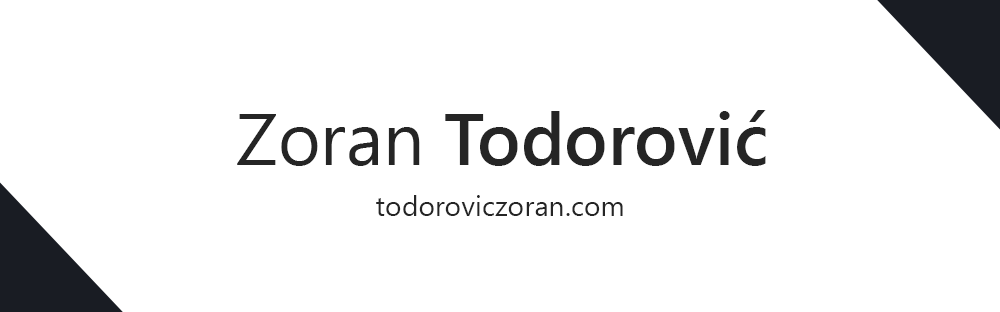

<h2 align="left">Hi there, I'm <a href="todoroviczoran.com" target="_blank" rel="noopener noreferrer">Zoran Todorović</a>
 </h2>

- 🌐 I'm a Front-end Web Developer
- 💻 I’m currently learning Webflow
- ⭐ 2025's Objective: To do more freelance work!
- 🎸 I love to play guitar and produce music!

#### Languages and Tools 

 
 
 
 
 

 

<!-- <a href="https://www.adamalston.com/">wi*quL3fcV</a> -->

#### Find me on  
<!--

   &nbsp;&nbsp;
 &nbsp;&nbsp;
 &nbsp;&nbsp;
 &nbsp;&nbsp;
 &nbsp;&nbsp;
 &nbsp;&nbsp;
 
 

 -->

 

   &nbsp;&nbsp;
 &nbsp;&nbsp;
 &nbsp;&nbsp;
 &nbsp;&nbsp;
 &nbsp;&nbsp;
 &nbsp;&nbsp;
 &nbsp;&nbsp;
 
 

-----
